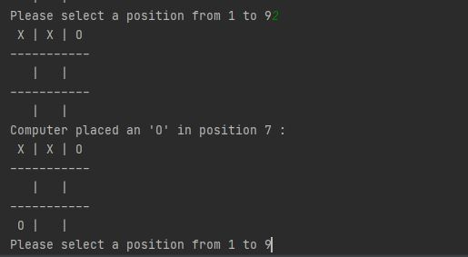
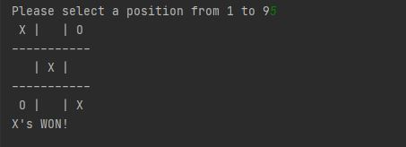

# Tic-Tac-Toe
> Tic-Tac-Toe game created in Python

## Table of contents
* [General info](#general-info)
* [Screenshots](#screenshots)
* [Technologies](#technologies)
* [Setup](#setup)
* [Features](#features)
* [Status](#status)
* [Inspiration](#inspiration)
* [Contact](#contact)

## General info
Simple Tic Tac Toe game with ai 

## Screenshots

## Technologies
* Python - version 3.7

## Setup
To run this project download the files and run the code in any interpreter. 

## Features
List of features ready and TODOs for future development
* Simple game board printed in console
* Ai that will try to win and prevent player from winning

To-do list:
* Board visualisation

## Status
Project completed. 

## Inspiration
Inspired by youtube channel: Tech With Tim

## Contact
[@Piotr Kowalewski](https://pkow.herokuapp.com) - feel free to contact me!
